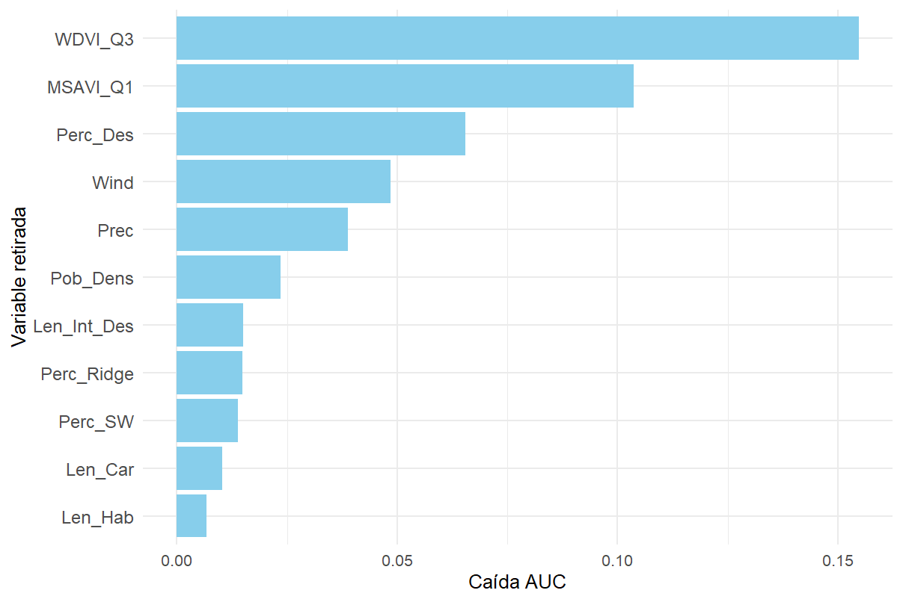
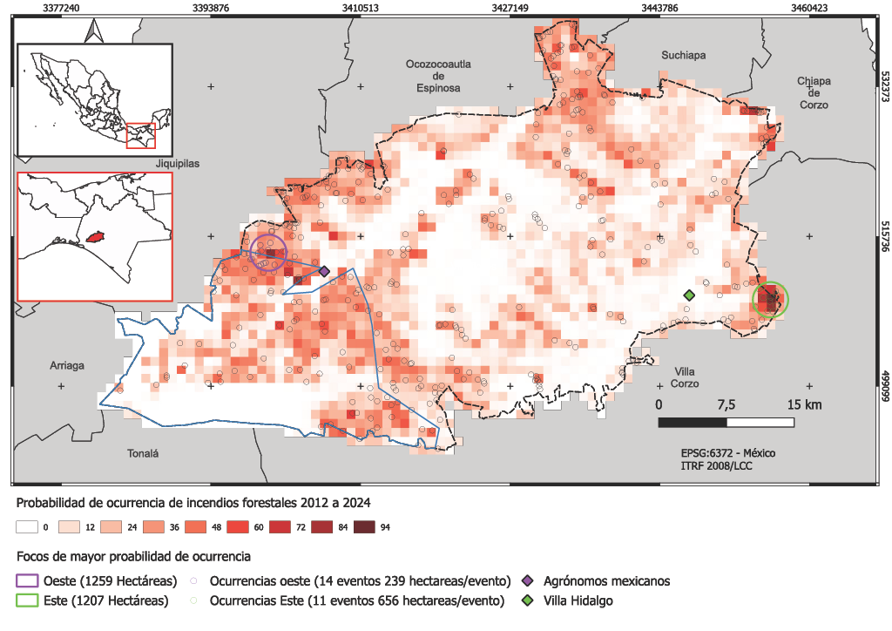

```{r setup, include=FALSE}
knitr::opts_chunk$set(echo = TRUE)
```

## Overview

This repository contains the R scripts and documentation for my thesis, which models forest fire ignition probability in Villaflores, Chiapas, Mexico. The project integrates geospatial and statistical methods to assess fire risk. It uses climate, topographic, demographic, and vegetation data, with applications for environmental management and policy.

## Skills Demonstrated

-   **Geospatial Analysis**: Process and analyze spatial data (DEMs, land cover, Landsat imagery, census data) using `terra` and `sf`.
-   **Spatial Modeling**: Build and evaluate logistic regression models with `glm`, `pROC`, and `MuMIn`.
-   **Data Processing**: Clean and interpolate datasets (e.g., kriging for population density) with `dplyr` and `gstat`.
-   **Visualization**: Create maps, correlation plots, and ROC curves with `ggplot2` and `corrplot`.
-   **Reproducible Workflows**: Structure code and documentation for collaboration and transparency.

## Key Features

-   **Data Processing**: Climate(WorldClim), topographic (Digital Elevation Model), demographic (Mexican census and roads networks), and landscape (vegetation land cover, Landsat imagery) analysis.
-   **Analysis**: Spatial interpolation (ordinary kriging), logistic regression modeling, and AUC evaluation (mean AUC \~0.8).
-   **Tools**: R packages `terra`, `sf`, `dplyr`, `ggplot2`, `pROC` and more.
-   **Outputs**: Fire occurrence maps, variable importance plots, and model performance metrics.

## Repository Structure

``` markdown
Villaflores_Wildfire/
├── scripts/                    # R scripts for analysis ()
│   ├── topography.R           # Topographic analysis (DEM, slope, TPI)
│   ├── climate.R              # Climate data processing (WorldClim)
│   ├── demography.R           # Demographic analysis (census, roads)
│   ├── landscape.R            # Land cover and vegetation analysis
│   ├── ignition_analysis.R    # Fire ignition point analysis (2012-2024)
│   ├── grid.R                 # Grid-based spatial analysis
│   ├── model.R                # Logistic regression modeling
│   ├── test.R                 # Model evaluation and validation
│   └── README.md              # Script-specific instructions
├── data/                      # Not included in repo (see Setup and Usage)
├── output/                    # Analysis outputs
│   ├── plots/                 # Visualizations (e.g. model AUC)
│   ├── models/                # Models
│   └── grid/                  # Spatial outputs (e.g., malla_mod_F15.shp)
├── docs/                      # Documentation
│   ├── thesis_summary.pdf     # Thesis overview
│   └── visualizations/        # Key figures (e.g., QGIS maps)
├── README.md                  # This file
├── LICENSE                    # MIT License
└── .gitignore                 # Ignores temporary/large files
```

## Setup and Usage

1.  Install R (version \>= 4.0) and required packages:

```{r}
install.packages(c('terra', 'sf', 'dplyr', 'tidyterra', 'ggplot2', 'pROC', 'ROCR',
                      'readr', 'tidyr', 'openxlsx', 'lubridate', 'parzer', 'leaflet',
                      'corrplot', 'usdm', 'rgee', 'RStoolbox', 'raster', 'rgeos',
                      'exactextractr', 'car', 'splines', 'mgcv', 'lme4', 'lmtest',
                      'glmmTMB', 'performance', 'pscl', 'DescTools', 'fmsb', 'cvAUC',
                      'MuMIn', 'PresenceAbsence', 'landform', 'geodata', 'maptools',
                      'classInt', 'RColorBrewer', 'rasterVis', 'spatialEco', 'gridExtra'))
```

2.  Clone the repository: git clone [https://github.com/ASalonio/Villaflores_Wildfire.git](https://github.com/ASalonio/Villaflores_Wildfire){.uri}

3.  Download data for terrain analysis and model inputs: [Kaggle dataset](https://www.kaggle.com/datasets/augustosalonio/villaflores-wildfire/data)

4.  Run scripts in order: `topography.R → climate.R → demography.R → landscape.R → ignition_analysis.R → grid.R → model.R → test.R`.

## Key Results

-   Developed a logistic regression model with AUC \~0.8 and Pseudo-R² ≈0.3
-   Identified vegetation density proxies (WDVI_Q3, MSAVI_Q1), road density, population density, and wind speed as key predictors of fire risk.
-   Produced geospatial outputs including fire ignition probability maps, to support fire management strategies in Villaflores.
-   Results can inform local fire prevention policies by highlighting high-risk areas and key environmental drivers

## Visualizations

Below is the variable importance plot, showing the contribution of predictors to fire risk prediction (from `test.R`), and Villaflores fire ignition probability for the years 2012 to 2024.

```{r pressure, echo=FALSE}


```

```{r pressure, echo=FALSE}


```

## Visualizations

See docs/visualizations for additional outputs, including thesis summary and fire ignition probability. map.

## Contact

Connect with me on [LinkedIn](https://www.linkedin.com/in/augusto-salonio-442621132/) or email [augusto93921\@gmail.com](mailto:augusto93921@gmail.com){.email}.

## Licence

This project is licensed under the MIT License - see the [LICENSE](https://github.com/ASalonio/Villaflores_Wildfire/blob/main/LICENSE) file for details.

## Citations

If you use this repository or dataset in your research, please cite:

Augusto Pablo Salonio Carbó (2025). Fire Risk Analysis in Villaflores, Mexico. GitHub repository,[https://github.com/ASalonio/Villaflores_Wildfire.git](https://github.com/ASalonio/Villaflores_Wildfire){.uri}

## Acknowledgements

-   **INEGI** for census and geospatial data from Mexico.
-   **NASA** for Landsat imagery.
-   **WorldClim** for climate data.
-   Open-source R packages and the R community for their tools and support.
